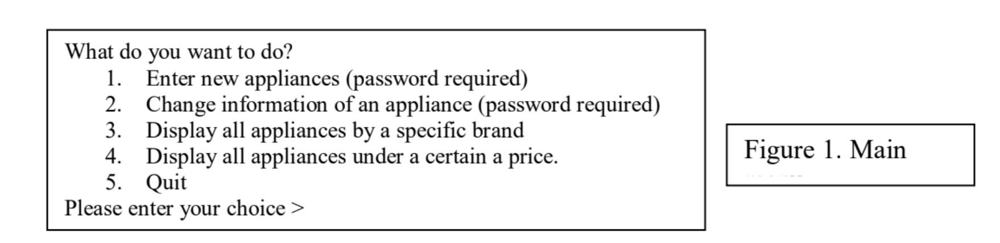
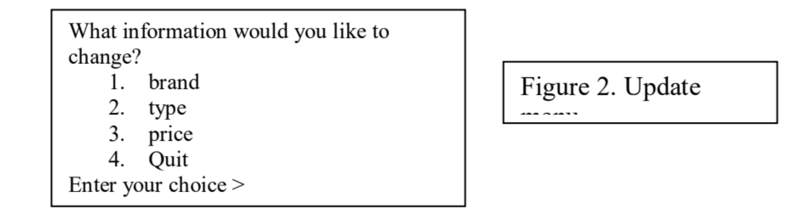

# COMP249-A1
Java
You are hired by a major appliance dealer to write a software that helps the store owner in acquiring and keeping track of appliances at the store.  
Part 1) 
An appliance object has four attributes, a type, a brand, a serial number, and a price.  - The type of an appliance can be any of the following: Fridge, AirConditioner, Washer, Dryer, Freezer, Stove, Dishwasher, Water Heaters, and Microwave.
 - The brand indicates the vendor/manufacturer of the appliance (such as LG, Samsung, Bosch, etc.).
 - The serial number represents the serial number of the appliance, and must
be unique. For simplicity, we assume that the serial numbers start at 1000000 and it is
common/shared among all different brands and types
 - The price of an appliance cannot be less than 1$.  
For this part, you are required to design and implement the Appliance class according to the following specifications: 
1 - Upon the creation of an appliance object, the object must immediately be initialized with valid values; that is type, brand, serial number and price. 
2 - The design should allow enough flexibility so that the value of any of these attributes can be modified later on (with the exception of the serial number, which can never be changed once assigned). 
3 - The design should allow all information of an object to be displayed at once through the utilization of System.out.print() method. 
4 - It is required to know how many appliance objects have been created. For that, you need to add a method, called findNumberOfCreatedAppliances(), to the class. This method
must return the number of created appliance objects prior to the time this method is
called. The method would simply return 0 if no appliances have been created by the time
the method is called. 
5 - It is required to compare two Appliance objects for equality. Two appliances are
considered equal if they have the same brand, type and price.
6 - It is required to display any Appliance object (all info of that object) using
System.out.println() method.  
Part 2) 
A main() method that will: 
1 - Display a welcome message; 
2 - Prompt the store owner for the maximum number of appliances his/her
store can contain. Create an empty array, called inventory, that will have the potential of keeping track of the created Appliance objects. 
3 - Display a main menu (Figure 1) with the following choices and keep prompting the user
until they enter a number between 1 and 5 inclusive (i.e invalid number will result in
repeating the display of the main menu): 
  

&nbsp; &nbsp; &nbsp; &nbsp; &nbsp; &nbsp; I. Option 1: Prompt the store owner for his/her password. (Make sure you have a constant variable containing the password “c249”. The store owner has a maximum of 3 attempts to enter the correct password. After the 3rd illegal entry, the main menu in Figure 1 is re-
displayed again. Additionally after this process is repeated 4 consecutive times (i.e. total failed attempts is 12 consecutive attempts by now), the program must display the
following messages: “Program detected suspicious activities and will terminate
immediately!”, then the program must exits. 
If the correct password is entered (which will reset the counter of failed attempts), ask the owner how many appliances he/she wants to enter. Check that there is enough space in
the store to add these many appliances. If so, add them; otherwise
inform the owner of the maximum remaining places in the array. 

&nbsp; &nbsp; &nbsp; &nbsp; &nbsp; &nbsp; II. Option 2: Prompt the store owner for his/her password. (Still, password is “c249”). Again the store owner has 3 attempts to enter the correct password. However, after the 3rd illegal entry, the main menu in Figure 1 is simply re-displayed again (notice the different behaviour in that case from the previous one above). 
Ask the user of the serial number of the appliance he/she wishes to update. If there
is no object with that serial number in the array inventory, display a message
indicating that and ask the user if he/she wishes to re-enter another serial number,
or quit this operation and go back to the main menu. If the entered serial number
exists, display the current information of that appliance in the following format: 
Appliance Serial # xxxxxxx (where xxxxxxx is the serial number) 
Brand: brand of the appliance 
Type: type of the appliance 
Price: price 
Then ask the user which attribute he/she wishes to change by displaying the
following menu:
 

Once the user has entered a correct choice, ask the user for the new information and make the changes to the object attribute then display again all of the attributes on the screen to show that the change has taken place. Keep prompting the user for additional changes until the user enters 4. Each time the user is prompted for a choice, make sure that a number from 1 to 4 is entered, otherwise keep prompting until a valid number is entered. You should pay a special attention to the change when it comes to type, as the different types are specific and limited (cannot be different than the types indicated in the initial description in Part I above). 

&nbsp; &nbsp; &nbsp; &nbsp; &nbsp; &nbsp; III. Option 3: prompt the user to enter a brand name. You then need to display the information of all appliances in the inventory with that brand.

&nbsp; &nbsp; &nbsp; &nbsp; &nbsp; &nbsp; IV. Option 4: prompt the user to enter a value (representing a price). You then need to display all appliances in the store that have a price smaller than that entered value.

&nbsp; &nbsp; &nbsp; &nbsp; &nbsp; &nbsp; V. Option 5: display a closing message and end the program.

